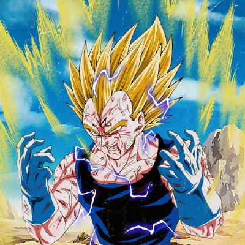

<div align="center">


<br/><br/>

<a href="https://github.com/fzn011">
  
</a>

<br/><br/>


<br/><br/>

**`⚡ Code Architect  ·  Data Alchemist  ·  AI Engineer`**

<br/>

[](https://fzn011.github.io/portfolio/)
[](https://www.linkedin.com/in/faiaz-zahin21/)
[](mailto:faiazzahin@gmail.com)
[](https://drive.usercontent.google.com/uc?id=1wK6YLanh0YXeHYw4cu3_p7yL9_Edn_V6&export=download)
[](https://www.facebook.com/iamfzn0/)

<br/><br/>


</div>

<br/>

<table>
<tr>
<td width="33%" align="center">
<h3>🎯 Focus</h3>
AI / ML<br/>Data Analysis<br/>Full Stack
</td>
<td width="33%" align="center">
<h3>🔥 Now</h3>
AI for Bangladesh's<br/>Cultural Heritage
</td>
<td width="33%" align="center">
<h3>📍 Base</h3>
Dhaka, Bangladesh<br/>he/him
</td>
</tr>
</table>

<br/>

### `> whoami`

```python
class FaiazZahin:
    role      = "CS Graduate & Builder"
    stack     = ["Python", "React", "Django", "ML/NLP"]
    building  = "Intelligent systems that matter"
    learning  = ["Deep Learning", "System Design", "NLP"]
    contact   = "faiazzahin@gmail.com"
```

<br/>

<div align="center">

### ⚙️ Tech Stack


</div>

<br/>

### 🚀 Featured Work

<div align="center">

| | Project | Tech | |
|:---:|:--------|:-----|:---:|
| 🧠 | **AI Job Market Intelligence** | Python · NLP · Streamlit | [→](https://github.com/fzn011/AI-Job-Market-Intelligence-Skill-Gap-Recommender) |
| ⚽ | **World Cup Prediction Model** | Python · ML | [→](https://github.com/fzn011/WorldCupPredictionModel) |
| ❤️ | **Cardiovascular Disease Prediction** | Jupyter · Scikit-learn | [→](https://github.com/fzn011/Cardiovascular_Disease_Prediction) |
| 🎵 | **Spotify × Billboard Top 100** | Python · Web Scraping | [→](https://github.com/fzn011/Spotify-Playlist-by-scraping-Billboard-top-100-of-any-year) |
| 🌐 | **Personal Portfolio** | HTML · CSS · JS | [Live](https://fzn011.github.io/portfolio/) |
| 👕 | **Clothing Store** | Django · HTML | [→](https://github.com/fzn011/Clothing-Store-Website-using-DJANGO) |

</div>

<br/>

<div align="center">

### 📊 Analytics


<br/>


<br/><br/>


<br/><br/>

### 🐍 Snake

<picture>
  <source media="(prefers-color-scheme: dark)" srcset="https://raw.githubusercontent.com/fzn011/fzn011/output/github-contribution-grid-snake-dark.svg">
  <source media="(prefers-color-scheme: light)" srcset="https://raw.githubusercontent.com/fzn011/fzn011/output/github-contribution-grid-snake.svg">
  
</picture>

<br/><br/>


<sub>⭐ Star a repo · Connect on LinkedIn · Let's collaborate</sub>

</div>
