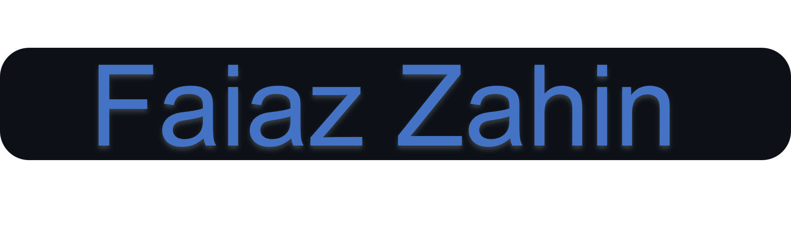

<div align="center">


<br/><br/>


<br/><br/>

<a href="https://github.com/fzn011">
  
</a>

<br/><br/>

**`Code Architect  ·  Data Storyteller  ·  AI Explorer`**

<br/>

[](https://fzn011.github.io/portfolio/)
[](https://www.linkedin.com/in/faiaz-zahin21/)
[](mailto:faiazzahin@gmail.com)
[](https://drive.usercontent.google.com/uc?id=1wK6YLanh0YXeHYw4cu3_p7yL9_Edn_V6&export=download)
[](https://www.facebook.com/iamfzn0/)

<br/><br/>


</div>

---

### ⚡ About Me

```python
class FaiazZahin:
    location    = "Dhaka, Bangladesh 🇧🇩"
    focus       = ["AI/ML", "Data Analysis", "Full Stack Development"]
    currently   = "AI solutions for Bangladesh's cultural heritage"
    learning    = ["Deep Learning", "NLP", "System Design"]
    fun_fact    = "Diverse interests — code by day, curiosity always on"
```

<table>
<tr>
<td width="50%" valign="top">

🔭 **Now building**  
Innovative AI solutions for the digitalization & preservation of Bangladesh's cultural heritage

🌱 **Leveling up in**  
Artificial Intelligence · Machine Learning · Full Stack · DBMS

</td>
<td width="50%" valign="top">

👨‍💻 **Explore my work**  
[GitHub Repositories](https://github.com/fzn011?tab=repositories) · [Live Portfolio](https://fzn011.github.io/portfolio/)

📫 **Reach me**  
`faiazzahin@gmail.com`

📄 **Experience**  
[Download CV](https://drive.usercontent.google.com/uc?id=1wK6YLanh0YXeHYw4cu3_p7yL9_Edn_V6&export=download)

</td>
</tr>
</table>

---

<div align="center">

### 🛠️ Tech Arsenal


<br/><br/>


</div>

---

### 🚀 Featured Projects

<div align="center">

| Project | Stack | Link |
|:--------|:------|:-----|
| **AI Job Market Intelligence** | `Python` `NLP` `Streamlit` | [Repo](https://github.com/fzn011/AI-Job-Market-Intelligence-Skill-Gap-Recommender) |
| **World Cup Prediction Model** | `Python` `ML` | [Repo](https://github.com/fzn011/WorldCupPredictionModel) |
| **Cardiovascular Disease Prediction** | `Jupyter` `Scikit-learn` | [Repo](https://github.com/fzn011/Cardiovascular_Disease_Prediction) |
| **Spotify × Billboard Top 100** | `Python` `Web Scraping` | [Repo](https://github.com/fzn011/Spotify-Playlist-by-scraping-Billboard-top-100-of-any-year) |
| **Personal Portfolio** | `HTML` `CSS` `JS` | [Live](https://fzn011.github.io/portfolio/) · [Repo](https://github.com/fzn011/portfolio) |
| **Clothing Store (Django)** | `Django` `HTML` | [Repo](https://github.com/fzn011/Clothing-Store-Website-using-DJANGO) |

</div>

---

<div align="center">

### 📊 GitHub Analytics


<br/>


<br/><br/>


<br/><br/>

### 🐍 Contribution Snake

<picture>
  <source media="(prefers-color-scheme: dark)" srcset="https://raw.githubusercontent.com/fzn011/fzn011/output/github-contribution-grid-snake-dark.svg">
  <source media="(prefers-color-scheme: light)" srcset="https://raw.githubusercontent.com/fzn011/fzn011/output/github-contribution-grid-snake.svg">
  
</picture>

<br/><br/>


**⭐ Star a repo if something catches your eye — it fuels the next build.**

</div>
